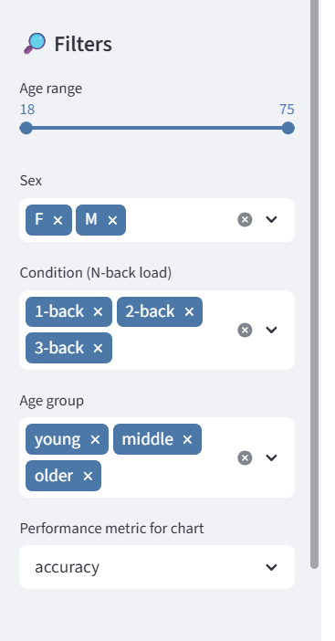

# Week 11 — N-back Working Memory Dashboard

NS5116 電腦硬體與程式語言（Spring 2026）— Week 11 作業
Author: **Irene Ho**（中央大學認知神經科學所）

## Overview
互動式 Streamlit dashboard，分析 200 位受試者、三種 n-back 條件（1/2/3-back）的工作記憶資料。使用者可依年齡、性別、年齡組、條件動態篩選，並切換顯示 accuracy / RT / d′。



## Dataset
`data/nback_working_memory.csv`（600 列）
- participant_id, age (18–75), sex, education, group (young/middle/older)
- condition (1/2/3-back), n_trials, accuracy, mean_rt_ms, d_prime

## Features
- ✅ 資料讀取＋錯誤處理（`st.error` + `st.stop`）
- ✅ Sidebar 控制元件：年齡 slider、性別 / 條件 / 年齡組 multiselect、指標 selectbox
- ✅ 三欄 metrics：人數、平均 accuracy、平均 RT
- ✅ matplotlib 散布圖＋線性回歸（依條件分色）
- ✅ Filtered DataFrame 顯示 + CSV 下載
- ✅ Bonus：tabs 多頁介面、`st.success/warning/info` 狀態訊息、變項字典

## Run locally
```bash
# 啟用虛擬環境（Windows / PowerShell）
.\streamlit\Scripts\Activate.ps1

# 安裝套件
pip install -r requirements.txt

# 啟動 app
streamlit run app.py
```

## Live demo
- GitHub: <https://github.com/ireneho3507/ncu-compneuro-week11-nback>
- Streamlit Cloud: _部署中_

## Audience reflection (100 words)
This dashboard targets **cognitive neuroscience students and researchers** exploring
how working-memory load and aging interact. The sidebar surfaces the three filters
that matter most for this literature — age, condition, and group — so a viewer can
quickly reproduce classic findings: accuracy and d′ drop steeply from 1-back to
3-back, and the drop is sharper in older adults, while RT rises monotonically with
both load and age. Tabs separate descriptive statistics, the age-by-performance
scatterplot, and the raw filtered table, letting researchers move between summary
and inspection. The CSV export supports downstream analysis in R or Python.
